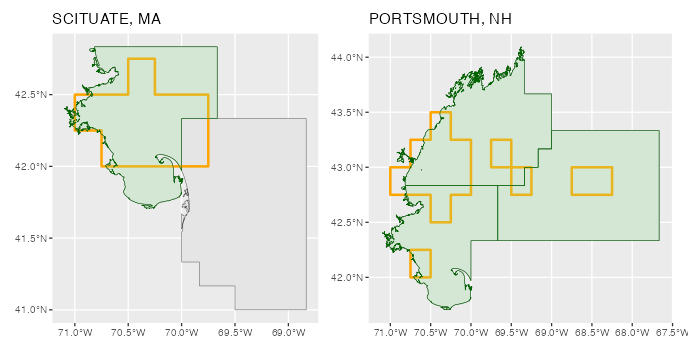

# Coca Results Processing and Shiny App Development

## What's in here?

This repo handles the results post-processing for VAST SDM projections.
This is also the home of the Shiny app development and testing code.

### Processing Order

When species distribution models have been run, their output projections
are put into a designated lab folder for the project on Box

These raw model outputs can be found here:\
`Mills Lab/Projects/COCA19_Projections/`.

Each model follows this naming convention:\
`{Species}_full_CMIP6_{SSP Scenario}_mean.rds`

**ex.**\
`AtlanticMackerel_full_CMIP6_SSP1_26_mean`

## R/01_vast_projection_preprocessing

This script is responsible for gathering all the different species and
scenario outputs and processing them in the following ways:

-   Density projections are pulled from the larger outputs

-   Seasonal density estimates are smoothed over time using a 5-year
    rolling average, performed at each Lat/Lon node

-   A dataframe of the rolling-average density projections are exported
    locally for further pre-processing for the app:
    `VAST_all_densities_all_species.csv`

-   Node locations are given unique ID's, and these locations are then
    saved as a standalone file:
    `Data/spatial/unique_location_coords.csv` . These can be used to
    more efficiently flag nodes that fall within a given shapefile etc.

-   Baseline period average densities are calculated, and exported
    locally at:
    `Data/projections/VAST_baseline_2010to2019_densities_all_species.csv`

Everything in this script is then passed for further processing.

## R/02_vast_horizon_summaries.R

This script begins at the processing starting point or the 5-year
rolling average density estimates for all the species:
`VAST_all_densities_all_species.csv`.

It then processes the average biomass density for each species &
scenario at specific points in the future. These periods are determined
outside this repo, but correspond with when both the SSP1 and SSP5
scenarios cross important temperature milestones above our baseline
period climate of 2010-2019 for our study area.

We end with two files:\
1. The average annual densities at these horizons:
`Data/projections/Cmilestones_all_species_test.csv` 2. The average
seasonal densities at these horizons:
`Data/projections/Cmilestones_all_seasons_test.csv`

These are used to power the maps projecting spatial distributions at
these points in the future.

## R/03_vast_regional_summaries.R

This script begins at the processing starting point or the 5-year
rolling average density estimates for all the species:
`VAST_all_densities_all_species.csv`.

The purpose at this step is to produce timeseries specific to a number
of areas of interest:

-   Ecological Production Units

    -   Gulf of Maine

    -   Georges Bank

    -   Mid-Atlantic Bight

-   Local Regions based on Statistical Areas:

    -   Downeast Maine

    -   Midcoast Maine

    -   Southern Maine

    -   Northern MA

    -   Cape Cod

    -   Southern MA / RI

    -   NY / NJ \* NC / VA / DE

-   Port Community Footprints - from Vessel Trip Reports

**This script produces the following files:**\

Regional Timeseries:
`Data/projections/annual_regional_species_projections.csv`

VTR Footprint Timeseries:
`Data/projections/annual_community_footprint_projections.csv`

VTR Footprint Baselines:
`Data/projections/baseline_community_footprint_projections.csv`

## R/04_VTRfootprint_statarea_hybrid_summaries.R

For a small number of communities, the fishing gootprint represented by
the VTR data is quite small. For these communities we decided that a
larger region might better reflect the projected climate and fisheries
outcomes. This script details the rule based approach used to create new
footprints for small communities that uses the statistical areas for
fisheries management.

Timeseries for these communities are then generated here.

**This script produces the following files:**

`Data/projections/annual_small_footprint_szone_overlap_projections.csv`

`Data/projections/baseline_small_footprint_szone_overlap_projections.csv`

# App Development

The shiny app and supporting code can be found in the
`Coca_SDM_app_dev/` directory.

Data needed for the app to run is processed in the
`R/app_ready_data_prep/` directory.
